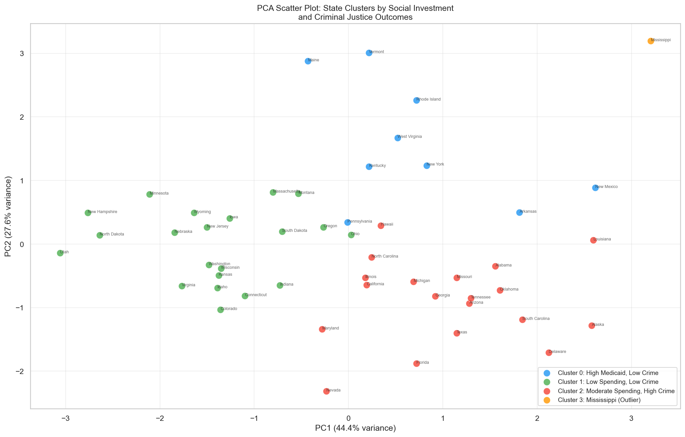
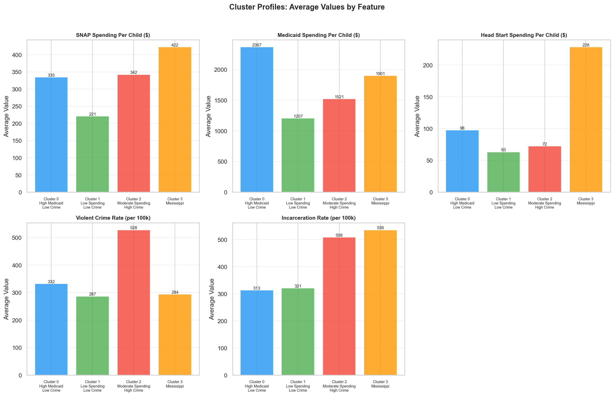
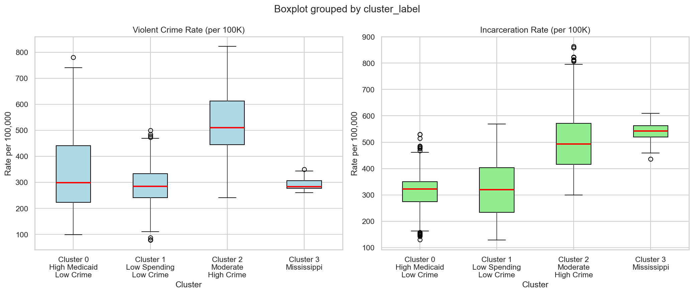
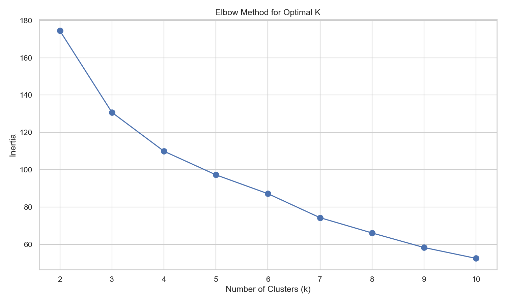

# An Apple a Day Keeps Prison Away

## Overview

**Do states that invest more in children's social programs see less crime and incarceration? Not in a straight line — but the states with the worst outcomes were never the ones investing the most.**

K-Means clustering of all 50 U.S. states on per capita children's social program investment (SNAP, Medicaid/CHIP, Head Start) against violent crime and incarceration rates, 2001–2016.

**Tools:** Python · pandas · scikit-learn · matplotlib · seaborn
**Methods:** K-Means clustering · PCA · ANOVA significance testing · silhouette validation

---

## Research Question

Public spending on children is usually defended on moral grounds. This project asked whether it also shows up in downstream criminal justice outcomes:

> *Do states with higher per capita investment in children's social programs have lower rates of violent crime and incarceration?*

The hypothesis going in was a simple inverse relationship — more investment, less crime.

## Findings

**The linear hypothesis was not supported.** But the clustering surfaced something more interesting than a clean correlation would have.

K-Means identified **four statistically distinct state clusters** (ANOVA p < 0.001 across all features), and they group along recognizable geographic lines:

| Cluster | States | Investment Profile | Violent Crime | Notable |
|---|---|---|---|---|
| **0** | 9 | High Medicaid/CHIP | **332 / 100K** — lowest | Highest spenders, best crime outcomes |
| **1** | 21 | Lowest overall spending | 287 / 100K | Low spending *and* low crime — breaks the hypothesis |
| **2** | 19 | Moderate | **528 / 100K** — highest | Worst outcomes, middling investment |
| **3** | 1 (Mississippi) | Extreme Head Start | Low | Low crime but high incarceration — a genuine outlier |

**The takeaway:** High investment doesn't guarantee good outcomes — Cluster 1 spends the least and does fine. But the states with the *worst* crime and incarceration (Cluster 2) weren't the low spenders either; they sat in the middle. That pattern is consistent with insufficient investment being associated with worse outcomes, even where more investment alone isn't sufficient to produce better ones.

Mississippi separating into its own cluster of one — extreme Head Start investment, low crime, high incarceration — is a reminder that incarceration rate and crime rate are measuring different things, and that sentencing policy lives outside this model entirely.

The clusters also track recognizable **geographic patterns**, despite the model being given no location data at all. That regional structure emerging on its own from spending and crime features is arguably the most interesting result here.

## Visualizations


*States projected onto the first two principal components, colored by cluster assignment. PC1 and PC2 together capture 71.98% of total variance.*


*Mean investment and outcome values by cluster, showing where the four groups separate.*


*Feature distributions within each cluster — the spread here is what the 0.3058 silhouette score reflects.*

🗺️ **[Interactive choropleth map](visualizations/choropleth_map.html)** — cluster assignment by state. The geographic grouping is the clearest signal in the whole analysis and isn't something the algorithm was given any location data to find. *(Download and open in a browser — GitHub doesn't render HTML inline.)*

## Source Data

| Source | File | Contents |
|---|---|---|
| Urban Institute — State-by-State Spending on Kids | `spending_on_kids.xlsx` | Per capita SNAP, Medicaid/CHIP, and Head Start investment by state-year |
| FBI Uniform Crime Reports | `ucr_by_state.xlsx` | Violent crime rates per 100,000 by state-year |
| Bureau of Justice Statistics | `prison_custody_by_state.xlsx` | Prison custody population by state-year |

Three separate multi-sheet Excel sources were cleaned and merged into a single state-year panel covering all 50 states, 2001–2016. Features were standardized with `StandardScaler` before clustering, since spending and crime rates live on wildly different scales.

## Approach

1. **Wrangling** — extracted and reshaped multi-sheet Excel workbooks; joined three sources into one state-year panel
2. **Standardization** — `StandardScaler` applied across all features
3. **Dimensionality reduction** — PCA for 2D visualization of cluster separation
4. **Clustering** — K-Means, with k = 4 selected via elbow method and silhouette scoring
5. **Validation** — ANOVA across clusters to confirm the groupings were statistically distinct, not artifacts of the algorithm


*Within-cluster sum of squares across candidate values of k. The bend at k = 4 informed the final choice.*

## Limitations

Stating these plainly because they shape how much weight the findings can carry:

- **Silhouette score of 0.3058** indicates acceptable but not strong cluster separation. The groups are real, but the boundaries are soft.
- **PCA captures 71.98% of variance**, meaning roughly 28% of the structure isn't visible in the 2D plots.
- **No control for baseline socioeconomic need.** States with greater need likely both spend more *and* have worse outcomes — this is the most probable confounder and the analysis doesn't address it.
- **Correlation does not imply causation.** Nothing here identifies a causal effect of spending on crime.

## Next Steps

The natural extension is controlling for baseline need — median household income, child poverty rate, urbanization — to separate "states that spend a lot" from "states that need a lot." Adding sentencing policy variables would also help explain the incarceration/crime divergence that made Mississippi its own cluster.

## Repository Structure

```
├── apple_a_day_capstone.ipynb   # Full analysis: wrangling → clustering → interpretation
├── data/                        # Source datasets (Urban Institute, FBI UCR, BJS)
├── visualizations/              # Exported charts
└── .gitignore
```

## Running It Yourself

```bash
git clone https://github.com/AliKatMcKin/apple-a-day-capstone.git
cd apple-a-day-capstone
pip install pandas numpy matplotlib seaborn scikit-learn openpyxl
jupyter notebook apple_a_day_capstone.ipynb
```

---

*Data Analytics Capstone for BS in Data Analytics at Western Governors University, 2026. Author: Alissa McKinney.*
